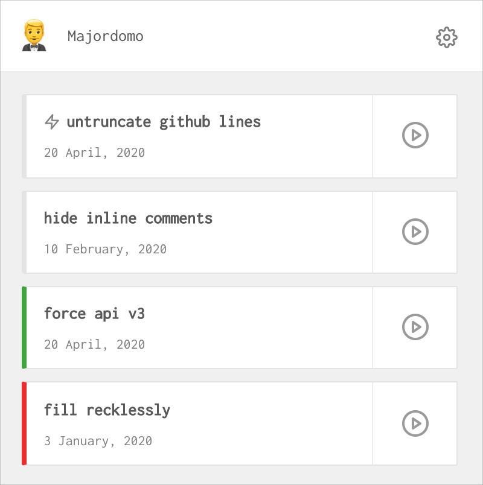

<div align="center">
	<h1>Majordomo</h1>



<p>
<br/>
<b>Save and execute custom javascript snippets</b></p>
</div>

<hr/>

## Installation
Install directly via the [chrome web store](https://chrome.google.com/webstore/detail/majordomo/amaoinacnciehgbddabgpginflahojjm).

For manual installation:
1. clone the repo
1. `npm install` (with node v10.16+)
1. `npm run build`
1. in Chrome, go to `More tools` ⭢ `Extensions`
1. click `Load unpacked` and select the `build/` directory

<br/>

## Development

### Getting started

Requires node 10.16+
1. run `npm run dev`
1. manually install the addon (see above)

**Other commands**
- tests: `npm run test`
- analyze bundle: `npm run analyze`
- convert icons: `npm run icons`


### Resolving modules
Currently support directory resolvers:
```js
{
	"@popup/*": [
		"src/popup/*"
	],
	"@background/*": [
		"src/background/*"
	],
	"@common/*": [
		"src/common/*"
	],
	"@options/*": [
		"src/options/*"
	]
}
```

To modify, update:
- `tscofig.json`
- `package.json` -> `jest.moduleNameMapper`
- `webpack/config.js` -> `resolve.alias`


## License
MIT
